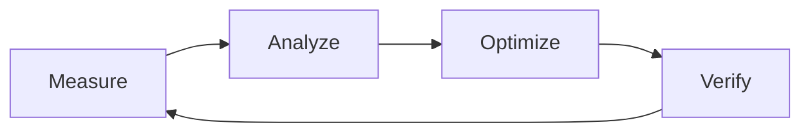

# Optimization Skill - System & Flow Optimization

> Methodology for achieving highest performance and efficiency in software systems and user flows.
> 2025 AI-assisted observability and systematic improvement techniques.

---

# 📋 Contents

1. [Optimization Principles (2025)](#1-optimization-principles-2025)
2. [Bottleneck Identification](#2-bottleneck-identification)
3. [AI-Driven Optimization](#3-ai-driven-optimization)
4. [Modern Observability](#4-modern-observability)
5. [Frontend & User Experience Optimization](#5-frontend--user-experience-optimization)
6. [Backend & Database Optimization](#6-backend--database-optimization)
7. [Systematic Improvement Cycle](#7-systematic-improvement-cycle)
8. [Checklist](#8-checklist)
9. [Don't Do List](#9-dont-do-list)
10. [Must Do List](#10-must-do-list)

---

# 1. Optimization Principles (2025)

| Principle                     | Description                                                   |
| ----------------------------- | ------------------------------------------------------------- |
| **Measurement Over Guessing** | You cannot optimize what you cannot measure.                  |
| **80/20 Rule (Pareto)**       | 80% of problems come from 20% of the code.                    |
| **Don't Optimize Early**      | First make it run, then make it right, finally make it fast.  |
| **User-Centric Metrics**      | Not just technical speed, perceived performance is important. |
| **AI-Assisted Analysis**      | Use AI tools to analyze complex datasets.                     |

---

# 2. Bottleneck Identification

## 2.1 Systematic Error & Slowness Detection

Follow these steps to identify bottlenecks:

1. **Profiling:** Determine which parts of the code consume CPU/Memory.
2. **Tracing:** Trace the journey of requests between systems.
3. **Log Analysis:** Find error and slowness patterns.
4. **User Flow Analysis:** Identify "steps" where the user gets stuck or slows down.

## 2.2 Signs of Bottlenecks

- **CPU Spikes:** Intense mathematical operation or infinite loop.
- **Memory Leaks:** Memory usage increasing over time and not dropping.
- **High Latency:** Database queries or external API dependencies.
- **Lock Contention:** Resource waiting times in concurrent operations.

---

# 3. AI-Driven Optimization

In 2025, optimization has evolved from manual analysis to AI-assisted analysis:

- **AI Profiling:** AI tools inspecting the codebase and predicting potential performance problems in advance.
- **Automated Refactoring:** AI replacing performance-reducing code blocks with "cleaner & faster" versions.
- **Predictive Scaling:** Predicting future load and preparing infrastructure in advance.

---

# 4. Modern Observability

## 4.1 OpenTelemetry and Full-Stack Visibility

It is not enough to just "monitor" the system, it is necessary to "understand" (observability):

- **Metrics:** Time-based numeric data (e.g., requests per second).
- **Traces:** The entire trail of a single request in the system (Microservices/Distributed tracing).
- **Logs:** Detailed event records.

## 4.2 Gözlemlenebilirlik Araçları

- **Prometheus & Grafana:** Metrik görselleştirme.
- **Jaeger/Zipkin:** Distributed tracing.
- **New Relic / Datadog:** Full-stack APM (Application Performance Monitoring).

---

# 5. Frontend & User Experience Optimization

## 5.1 Core Web Vitals (2025)

- **LCP (Largest Contentful Paint):** Loading time of the largest content.
- **INP (Interaction to Next Paint):** Response speed to user interaction (Replaced FID).
- **CLS (Cumulative Layout Shift):** Shifts in page layout (unpleasant jumps).

## 5.2 Techniques

- **Static Replacement:** Server-Side Rendering (SSR) or Static Site Generation (SSG) instead of JavaScript render.
- **Image Optimization:** WebP/AVIF formats, responsive sizes and lazy loading.
- **Bundle Splitting:** Not loading unused JavaScript (Tree shaking).

---

# 6. Backend & Database Optimization

## 6.1 Database Query Optimization

- **Indexing:** Adding indexes to correct columns can increase query speed by 100x.
- **N+1 Avoidance:** Using "include" or "join" instead of querying one by one.
- **Query Caching:** Keeping data that doesn't change frequently in memory-stores like Redis.

## 6.2 Conventional Techniques

- **Connection Pooling:** Keeping database connections open and reusing them.
- **Asynchronous Processing:** Moving time-consuming tasks (email sending etc.) to the background (background jobs).

---

# 7. Systematic Improvement Cycle

1. **Measure:** Measure current state (Baseline).
2. **Analyze:** Find bottleneck and cause.
3. **Optimize:** Make the change that will create the biggest impact.
4. **Verify:** Verify the effect of change on performance (Regression test).

---

# 8. Checklist

- [ ] Is bottleneck verified with technical data (metrics)?
- [ ] Are you sure no premature optimization is done?
- [ ] Is rollback plan ready for the change?
- [ ] Is "perceived performance" measured after change?
- [ ] Tested that no new bottleneck is created?

---

# 9. Don't Do List

❌ Do not change code without measuring.
❌ Do not decide based only on benchmark results (without real user data).
❌ Do not try to optimize too many parameters at once.
❌ Do not sacrifice code readability for "faster".

---

# 10. Must Do List

✅ Focus on 80/20 rule; improve most used flows.
✅ Make your system transparent using OpenTelemetry standards.
✅ Use AI tools for data analysis and pattern detection.
✅ Prioritize fixing "perceived" slowness via user flow analysis.
✅ Run regression tests after every optimization.

---

**Last Update:** December 2025
*Optimization v1.1 - Enhanced*

## 🔄 Workflow

> **Source:** [Google SRE Book - Performance](https://sre.google/sre-book/performance-engineering/) & [Brendan Gregg's Methodology](https://www.brendangregg.com/methodology.html)

### Phase 1: Baseline & Profiling
- [ ] **Metric Selection**: What will you optimize? (Latency, Throughput, Saturation, Error Rate).
- [ ] **Baseline Measurement**: Record "Before" data before optimization (Don't start without numbers).
- [ ] **Profiling**: Perform CPU (Flamegraph), Memory (Heap dump) or I/O analysis.

### Phase 2: Optimization Cycle
- [ ] **Hypothesis**: Establish hypothesis "If I change X, it will speed up by Y".
- [ ] **Small Steps**: Make one change at a time (Atomic commit).
- [ ] **Verification**: Measure again after change ("After" data). Is target reached?

### Phase 3: Prevention
- [ ] **Regression Test**: Add performance test to CI process (Load testing).
- [ ] **Alerting**: Set up alarms to notify if metrics get worse again.
- [ ] **Scalability**: Evaluate Vertical vs Horizontal scaling options.

### Checkpoints
| Phase | Verification                                                          |
| ----- | --------------------------------------------------------------------- |
| 1     | Did optimization make code more complex/unreadable? (Trade-off)       |
| 2     | Is measurement done in local environment consistent with Prod?        |
| 3     | Was a new bottleneck created while solving one (Bottleneck shifting)? |
